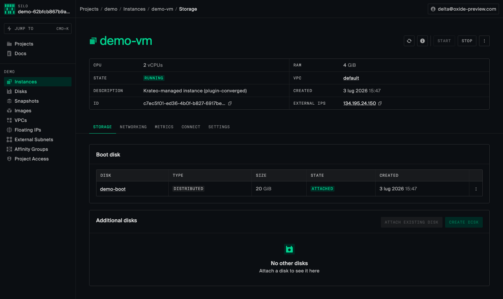
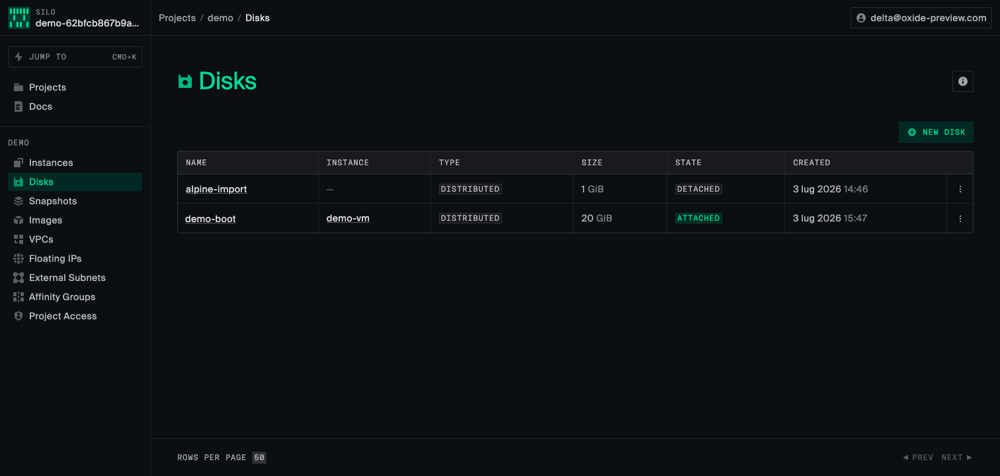

# Quickstart

Declare a **project, a VPC, a disk and an instance** as plain Kubernetes resources and watch Krateo
provision them in your Oxide silo — all reconciling to `READY=True`.

This walkthrough was verified end-to-end against a live Oxide preview silo on a throwaway
[kind](https://kind.sigs.k8s.io/) cluster, so you can reproduce it from scratch in a few minutes.

> **Which images.** Byte-sized fields (disk `size`, instance `memory`) are `int64`. Making them work
> end-to-end needs three fixes, so this guide pins the fixed builds:
> - `oasgen-provider` **≥ 0.10.4** — preserves the JSON-Schema `format`, so generated CRDs keep
>   `format: int64` instead of being downgraded to `int32` (which rejects any value above ~2 GiB).
> - `rest-dynamic-controller` **≥ 0.9.1** — compares numeric fields by value, so an `int64` in the CR
>   and the same number decoded as `float64` from the API response no longer look like drift.
> - this chart — models the instance `boot_disk` as an object (`{type, name}`), matching Oxide's API, and
>   ships an optional **convergence plugin** (`instancePlugin.enabled`) that attaches the boot disk and
>   starts the instance on reconcile, so applying the disk and instance together self-heals to a running
>   VM regardless of ordering.

## Prerequisites

- A Kubernetes cluster. This guide creates a local one with `kind`, but any cluster works.
- `kubectl`, `helm`, and the [`oxide` CLI](https://docs.oxide.computer/cli) on your workstation.
- The Krateo Helm repo:
  ```bash
  helm repo add krateo https://charts.krateo.io && helm repo update krateo
  ```
- Network reachability from the cluster to your **Oxide silo API** (e.g. `https://oxide.example.com`).

```bash
kind create cluster --name oxide-demo
kubectl create namespace krateo-system
```

## 1. Mint an Oxide API token into a Secret

Oxide authenticates with a long-lived device access token (`Authorization: Bearer <token>`). Log in once,
then capture the token into a Secret. The `oxide` CLI stores it in `~/.config/oxide/credentials.toml`:

```bash
oxide auth login --host https://oxide.example.com

# Pull the token straight from the credentials file (the CLI dropped `auth status --token`):
TOKEN=$(awk -F'"' '/^token/{print $2; exit}' ~/.config/oxide/credentials.toml)
kubectl create secret generic oxide-api-token \
  --from-literal=token="$TOKEN" -n krateo-system
```

> The token's scope decides what you can manage. A silo-collaborator token covers projects and everything
> inside them; the fleet-scoped resources (`OxideSilo`, `OxideIpPool`, `OxideSubnetPool`) need a
> fleet-admin token.

## 2. Install the fixed providers

`oasgen-provider` provides the generic reconciliation and deploys a `rest-dynamic-controller` per
resource. Install it with the fixed images:

```bash
helm install oasgen-provider krateo/oasgen-provider -n krateo-system \
  --set image.repository=ghcr.io/braghettos/krateo-oasgen-provider \
  --set image.tag=0.10.4 \
  --set rdc.image.repository=ghcr.io/braghettos/krateo-rest-dynamic-controller \
  --set rdc.image.tag=0.9.1

kubectl -n krateo-system rollout status deploy/oasgen-provider
```

## 3. Install the operator layer

```bash
helm install oxide-kog oci://ghcr.io/braghettos/charts/krateo-oxide-operator-kog \
  -n krateo-system --set oxide.apiUrl=https://oxide.example.com \
  --set instancePlugin.enabled=true
```

`instancePlugin.enabled=true` deploys the OxideInstance convergence plugin and points the instance
controller at it, so an instance attaches its boot disk and starts on reconcile — you can apply the disk
and instance together and it self-heals to a running VM (see step 5). Leave it off if you only need
create/get/delete semantics.

This creates 19 `RestDefinition`s. `oasgen-provider` turns each into a CRD pair — a `<Kind>Configuration`
and the resource `<Kind>` — and spins up its controller. Wait for them to register:

```bash
kubectl get restdefinitions -n krateo-system   # all READY=True
kubectl get crds | grep oxide.ogen.krateo.io
```

If you lack fleet-admin scope, disable the fleet resources:
`--set restDefinitions.silo.enabled=false --set restDefinitions.ippool.enabled=false --set restDefinitions.subnetpool.enabled=false`.

## 4. Wire the token into the Configuration CRs

Each generated `<Kind>Configuration` references the token Secret. Apply the ready-made set:

```bash
kubectl apply -f https://raw.githubusercontent.com/braghettos/krateo-oxide-operator-kog/main/chart/samples/00-configurations.yaml
```

## 5. Declare a project, VPC, disk and instance

```yaml
# demo.yaml
---
apiVersion: oxide.ogen.krateo.io/v1alpha1
kind: OxideProject
metadata: { name: demo, namespace: krateo-system }
spec:
  configurationRef: { name: oxide-api, namespace: krateo-system }
  name: demo
  description: "Krateo-managed demo project"
---
apiVersion: oxide.ogen.krateo.io/v1alpha1
kind: OxideVpc
metadata: { name: demo-vpc, namespace: krateo-system }
spec:
  configurationRef: { name: oxide-api, namespace: krateo-system }
  project: demo
  name: demo-vpc
  description: "Demo VPC"
  dns_name: demo-vpc
---
apiVersion: oxide.ogen.krateo.io/v1alpha1
kind: OxideDisk
metadata: { name: demo-boot, namespace: krateo-system }
spec:
  configurationRef: { name: oxide-api, namespace: krateo-system }
  project: demo
  name: demo-boot
  description: "20 GiB blank boot disk"
  size: 21474836480            # 20 GiB in bytes — an int64 value
  disk_backend:
    type: distributed
    disk_source: { type: blank, block_size: 4096 }
---
apiVersion: oxide.ogen.krateo.io/v1alpha1
kind: OxideInstance
metadata: { name: demo-vm, namespace: krateo-system }
spec:
  configurationRef: { name: oxide-api, namespace: krateo-system }
  project: demo
  name: demo-vm
  description: "Krateo-managed instance"
  hostname: demo-vm
  memory: 4294967296          # 4 GiB in bytes — an int64 value
  ncpus: 2
  start: true
  boot_disk: { type: attach, name: demo-boot }
  external_ips:
    - type: ephemeral
```

```bash
kubectl apply -f demo.yaml     # apply all four at once
```

The disk and instance are applied together on purpose: with `instancePlugin.enabled=true` the instance
attaches its boot disk and starts on reconcile, so it self-heals to running once the disk is provisioned —
no ordering required. (Without the plugin, apply the disk first, wait for `READY`, then the instance:
Oxide's create-time boot-disk attach no-ops on a not-yet-ready disk.)

Conventions to know:
- `spec.name` is the natural key Oxide addresses the resource by; the server UUID lands in `status.id`.
- project-scoped resources take `spec.project`; VPC children take `spec.vpc`; network interfaces take
  `spec.instance`.
- The boot disk here uses a `blank` source (no OS). Point `disk_source` at an `image`
  (`type: image, image_id: <uuid>`) to boot a real OS — import one with `oxide disk import` (it uploads a
  raw image and creates a bootable image in one command).

## 6. Verify

```bash
kubectl get oxideproject,oxidevpc,oxidedisk,oxideinstance -n krateo-system
```

```
NAME                                         READY
oxideproject.oxide.ogen.krateo.io/demo       True
oxidevpc.oxide.ogen.krateo.io/demo-vpc       True
oxidedisk.oxide.ogen.krateo.io/demo-boot     True
oxideinstance.oxide.ogen.krateo.io/demo-vm   True
```

Cross-check in Oxide — the `demo` project, the 20 GiB `demo-boot` disk and the 2-vCPU / 4-GiB `demo-vm`
instance are all there:

```bash
oxide project list
oxide disk list --project demo
oxide instance list --project demo
```

…or open the Oxide web console. The instance is **running**, booting the imported image, with the 20 GiB
boot disk attached:





## 7. Clean up

Deleting the CRs deletes the Oxide resources:

```bash
kubectl delete -f demo.yaml
kind delete cluster --name oxide-demo
```

## Troubleshooting

- **Disk/instance rejected at apply** with `must be of type integer with format int32` — the CRDs were
  generated by an `oasgen-provider` older than 0.10.4 (int64 downgraded to int32). Reinstall with the
  image pinned above.
- **Disk/instance stuck not `READY`** while `Synced=True` and the resource exists in Oxide — the
  `rest-dynamic-controller` is older than 0.9.1 and reports spurious numeric drift. Pin `rdc.image.tag`.
- **Instance create returns 400** — an older chart modelled `boot_disk` as a string; use this chart, where
  it is an object `{type, name}`.
- **401/403 from Oxide** — the token is missing, expired, or lacks scope. Recreate the Secret (step 1).
- **A picked-up asset change isn't regenerating the CRD** — `oasgen-provider` only regenerates when the
  RestDefinition's spec digest changes, not when the referenced schema ConfigMap does. Delete and
  reapply the `RestDefinition` (or reinstall the chart) to force a fresh generation.
